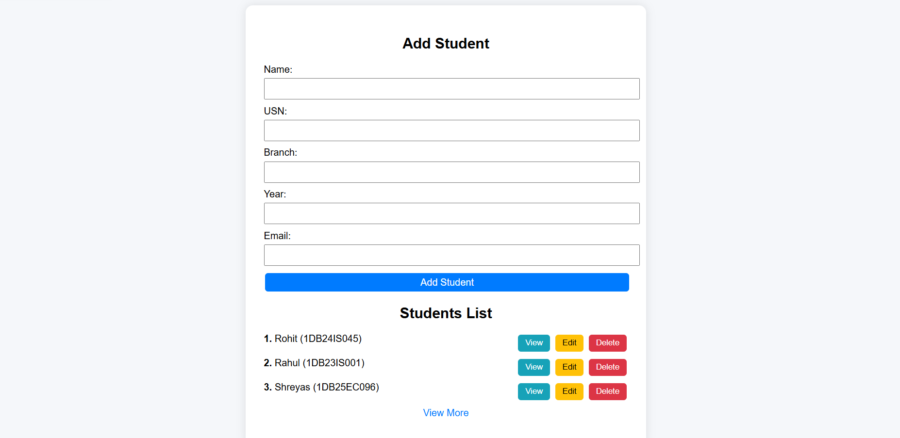
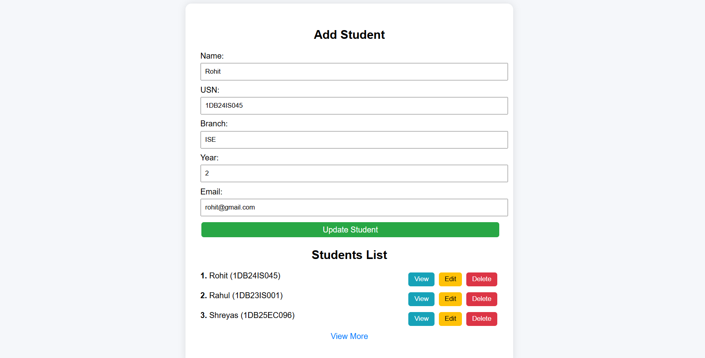
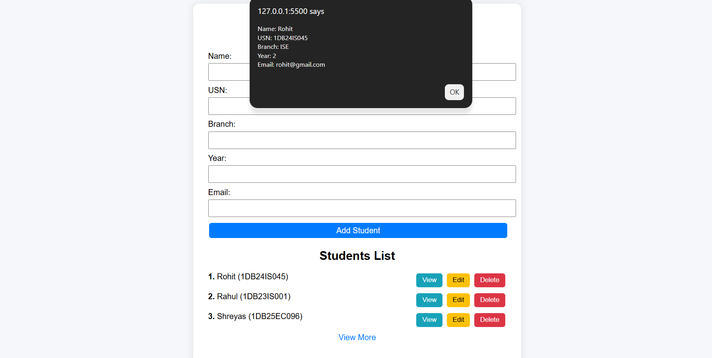
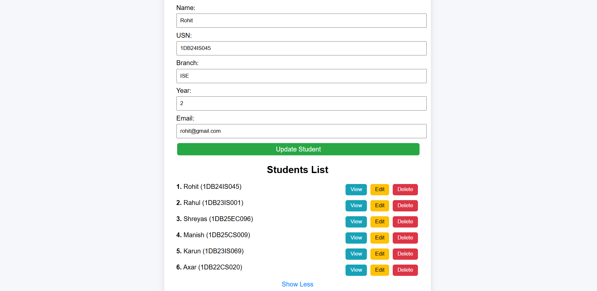

<h1 align="center">🎓 Student Management System</h1>

<p align="center">
  A simple full-stack web application to manage student records using FastAPI and MongoDB.
</p>

---

## 🚀 Features

- ➕ Add Student
- 📋 View Students
- ✏️ Update Student
- ❌ Delete Student
- 👁 View Full Details
- 📊 Serial Numbering
- 🔽 View More / Show Less
- 🎨 Clean UI with color buttons

---

## 🛠 Tech Stack

- **Frontend:** HTML, CSS, JavaScript  
- **Backend:** FastAPI (Python)  
- **Database:** MongoDB  

---

## 📸 Screenshots

### 🏠 Home Page


### ✏️ Edit Student


### 👁 View Student


### 📋 View More


---

## ⚙️ Installation & Setup

### 1️⃣ Clone the repository
```bash
git clone https://github.com/Adiveppa-git/student-management-system.git
cd student-management-system
